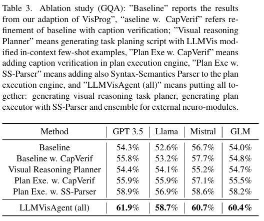

# LLMVisAgent: Visual Reasoning via Language-Vision Planner and Executor

This is the code for LLMVisAgent: Visual Reasoning via Language-Vision Planner and Executor.

Important library version:

```
pip install openai==0.28
pip install Pillow==9.5.0
```

**THIS CODE DOES NOT SUPPORT HIGHER VERSION OF openai AND Pillow!**

In our experiment, we run the code on Python 3.9.19 and torch2.4.1+cu121 with a single H100 or H200 GPU.

**Set the OpenAI API in the script beginning with "main_" before you run it.**

To run the baseline (visprog) without anything about our architecture, run `python main.py --model=<model name>`. Available model names: gpt, llama, mistral and glm.

To test Visual Reasoning Planner, run `python main_baseline1_v1.py --model=<model name>`

To test baseline with CapVerif, run `python main_caption.py --model=<model name>`

To test  Visual Reasoning Planner with CapVerif, run `python main_caption_baseline1_v1.py --model=<model name>`

To test Visual Reasoning Planner + CapVerif + SS-Parser, run `python main_baseline2_v1.py --model=<model name>`

To test the full LLMVisAgent, run `python main_baseline2_v2.py --model=<model name>`, this time remember to enable the ensemble of LOC and VQA in engine/step_interpreter.py. See the comments near LocInterpreter and VQAInterpreter. Ensembling is enabled by default, so you just need to enable it if you have disabled it for above tests.

**You need to modify LocInterpreter and VQAInterpreter in engine/step_interpreter.py to disable the ensembling of LOC and VQA. Refer to comments near/in these two classes.**

**results folder**: Python scripts starting with "eval" are evaluation scripts. Experimental results are saved in folders starting with "results_". To get the results reported in the paper, modify the method name in the script accordingly, and run it. eval.py evaluates both GQA and NLVR, comparing two methods and outputs their accuracy, and examples where different results occur. eval_single\_\<dataset\>.py evaluates the accuracy of four datasets without comparison on different methods. It only prints the accuracy on four datasets.

**logs folder**: Files ending in ".out" are log files when we are conducting experiments on a slurm server. The caption of each image and the analysis of the output verifier is recorded here if that method uses an output verifier.

**web folder**: Our web application for LLMVisAgent. It has a user interface and is more configurable than the experiment code. To start the server, run app.py under the web folder. The default port is 5000.

**datasets folder**: Contains datasets used in our paper: GQA, NLVR2 and VQAv2.

This repository is directly copied from our development environment. We are working on reorganizing the file structure to facilitate people who want to reproduce our results.

## Reported Accuracy




## Screenshot of Web Interface


